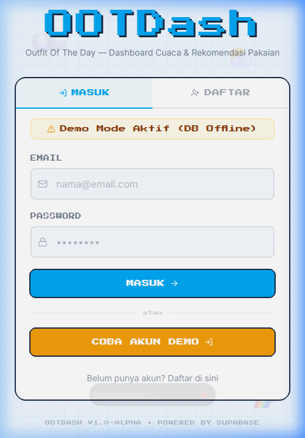
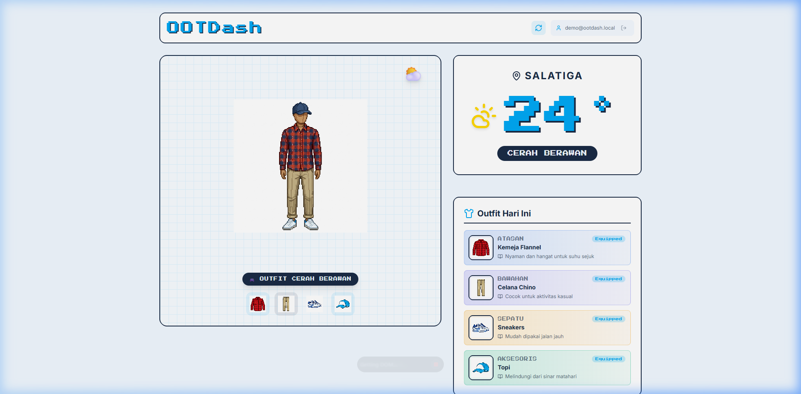

# OOTDash (Outfit of the Day Dashboard)

## 📸 Demo Tampilan Aplikasi

| Halaman Login (Demo Mode) | Halaman Dashboard Utama |
|:---:|:---:|
|  |  |

OOTDash adalah dashboard cuaca lokal interaktif yang dilengkapi dengan sistem rekomendasi pakaian menggunakan manekin 2D dinamis bergaya **Retro Pixel-Art**. Aplikasi ini secara cerdas mencocokkan kondisi cuaca dan suhu real-time dengan koleksi baju untuk memberikan rekomendasi gaya harian terbaik bagi pengguna.

---

## 🎨 Fitur Utama

- **Weather-Based Recommendations**: Menghitung rekomendasi pakaian (atasan, bawahan, sepatu, aksesoris) berdasarkan data suhu dan cuaca real-time dari OpenWeatherMap API.
- **Dynamic 2D Mannequin**: Manekin bergaya pixel-art yang secara dinamis memuat layer pakaian sesuai dengan rekomendasi sistem.
- **Robust Local Auth**: Sistem autentikasi pengguna menggunakan Better Auth dengan database PostgreSQL cloud (Neon), terintegrasi penuh di backend.
- **Responsive Layout**: Desain responsif bergaya retro "Sunny Retro Blue" yang ramah untuk tampilan desktop maupun perangkat mobile.
- **Offline Graceful Fallback**: Menggunakan data rekomendasi offline bawaan secara otomatis jika server atau API eksternal tidak dapat dihubungi.

---

## 💻 Tech Stack

- **Frontend**: React (Vite), Tailwind CSS, Zustand (State Management), Lucide React (Icons).
- **Backend**: Node.js (Express), TypeScript.
- **Database & ORM**: PostgreSQL (Cloud via Neon), Drizzle ORM (Type-Safe Query Builder).
- **External Integration**: OpenWeatherMap API & Better Auth.

---

## 📁 Struktur Folder Proyek

```
ootdash/
├── docs/               # Dokumentasi teknis & arsitektur proyek
├── client/             # Aplikasi Frontend (React + Vite)
│   ├── public/         # Aset statis & layer gambar manekin
│   └── src/
│       ├── components/ # Komponen UI utama
│       ├── hooks/      # Custom React hooks (useGeolocation)
│       ├── lib/        # File konfigurasi library (auth-client.js)
│       ├── store/      # State management (Zustand stores)
│       └── styles/     # Global stylesheets
└── server/             # Aplikasi Backend (Express TS)
    └── src/
        ├── controllers/# Logika utama pemrosesan data & cuaca
        ├── db/         # Skema database & seeder
        ├── middlewares/# Middleware auth & JWT validator
        └── routes/     # Konfigurasi endpoint Express
```

---

## 🛠️ Langkah Instalasi

### Prasyarat
- **Node.js** (v18 ke atas)

### 1. Kloning Repositori & Instalasi
Aplikasi ini menggunakan fitur **npm workspaces** sehingga instalasi dependensi cukup dilakukan di root folder:
```bash
git clone https://github.com/username/ootdash.git
cd ootdash
npm install
```

### 2. Konfigurasi Environment (Server)
1. Buat file `.env` di dalam folder `server/` berdasarkan template `.env.example`:
   ```bash
   cd server
   cp .env.example .env
   ```
2. Isi `DATABASE_URL` dengan credential Neon Anda dan `OPENWEATHER_API_KEY` di file `.env`.
3. Sinkronisasikan skema dan isi data awal database:
   ```bash
   npm run db:push
   npm run db:seed
   ```
4. Kembali ke root direktori:
   ```bash
   cd ..
   ```

### 3. Konfigurasi Environment (Client)
Aplikasi frontend secara default akan menghubungi backend lokal di port 3000. Jika Anda mendeploy server ke cloud, buat file `.env` di folder `client/`:
```env
VITE_API_URL=https://url-backend-anda.com
```

---

## 🏃 Cara Menjalankan Proyek

Berkat **npm workspaces** dan `concurrently`, Anda dapat menjalankan backend dan frontend sekaligus secara pararel cukup dengan satu perintah dari **root direktori**:

```bash
npm run dev
```

- Server akan berjalan di [http://localhost:3000](http://localhost:3000).
- Client (React) akan berjalan di [http://localhost:5173](http://localhost:5173).

---

## 📦 Cara Build Proyek

Untuk memproduksi bundel siap rilis:

- **Build Client (Frontend):**
  Di folder `client/`:
  ```bash
  npm run build
  ```
  Output hasil build akan terletak pada folder `client/dist/`.

- **Build Server (Backend):**
  Di folder `server/`:
  ```bash
  npm run build
  ```
  Kode JavaScript hasil kompilasi TypeScript akan terletak pada folder `server/dist/`.
