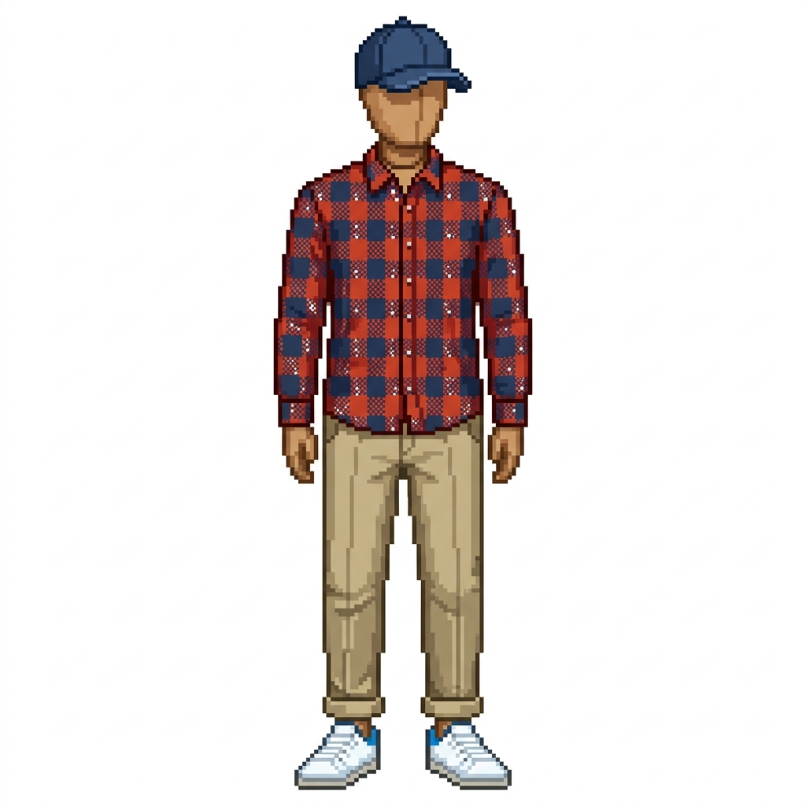

# 👕 OOTDash

OOTDash adalah dashboard cuaca lokal dengan sistem rekomendasi pakaian menggunakan manekin 2D bergaya **Retro Pixel-Art**. Aplikasi ini memberikan saran outfit (atas, bawah, sepatu, aksesoris) secara cerdas berdasarkan suhu dan kondisi cuaca real-time.



## ✨ Fitur Utama

- **Weather-Based Recommendations**: Logika pencocokan baju di backend berdasarkan data cuaca OpenWeatherMap.
- **Pixel-Art Aesthetic**: Estetika "Sunny Retro Blue" dengan aset pixel-art yang dikustomisasi.
- **Dynamic Mannequin**: Mannequin yang berubah tampilan sesuai dengan outfit yang direkomendasikan.
- **Local Auth**: Sistem autentikasi menggunakan Supabase Auth (Local Docker).
- **Responsive Design**: Layout split-screen yang optimal untuk desktop dan mobile.

## 🚀 Teknologi

- **Frontend**: React (Vite), TailwindCSS, Zustand, Lucide React.
- **Backend**: Node.js (Express), TypeScript, Drizzle ORM.
- **Database**: PostgreSQL (Supabase Local).
- **External API**: OpenWeatherMap API.

## 🛠️ Instalasi & Persiapan

### Prasyarat
- Node.js (v18+)
- Docker Desktop (untuk Supabase Local)

### 1. Clone Repositori
```bash
git clone https://github.com/username/ootdash.git
cd ootdash
```

### 2. Setup Database (Supabase)
Pastikan Docker Desktop sudah berjalan.
```bash
npx supabase start
```

### 3. Setup Server
```bash
cd server
npm install
# Salin .env.example ke .env dan isi API Key Anda
cp .env.example .env
# Sync schema dan seed data
npm run db:push
npm run db:seed
npm run dev
```

### 4. Setup Client
```bash
cd client
npm install
npm run dev
```

## 🔐 Environment Variables

Aplikasi membutuhkan beberapa API key:
- `OPENWEATHER_API_KEY`: Dapatkan dari [OpenWeatherMap](https://openweathermap.org/api).
- `SUPABASE_JWT_SECRET`: Biasanya didapat otomatis dari `npx supabase status`.

## 📜 Lisensi
MIT
