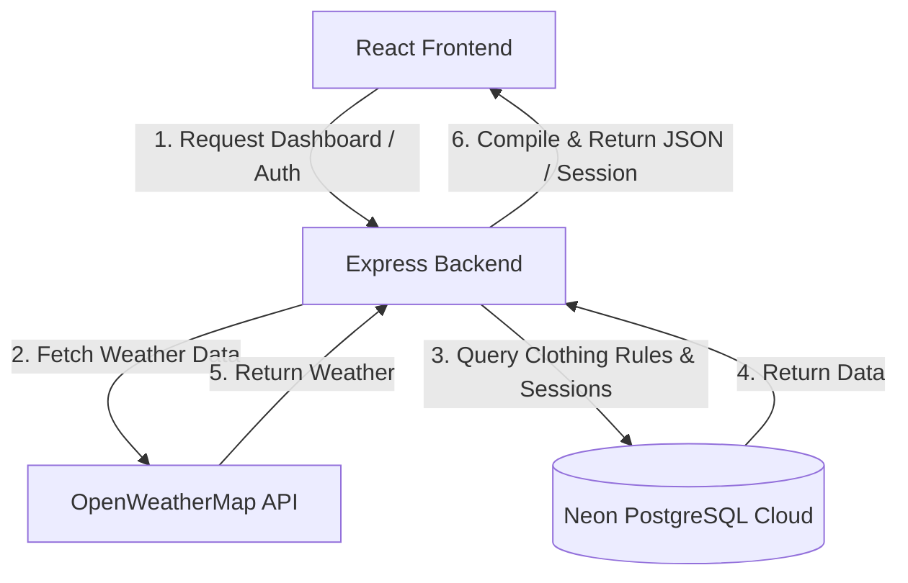

# Arsitektur Sistem - OOTDash

Dokumen ini menjelaskan desain teknis, struktur folder, dan aliran data dari proyek **OOTDash** versi terbaru (V2) yang menggunakan Better Auth dan Neon PostgreSQL Cloud.

---

## 1. Desain Sistem & Data Flow

OOTDash menggunakan pendekatan **Monorepo-lite** yang memisahkan aplikasi menjadi `client` (frontend React) dan `server` (backend Express + TypeScript). Seluruh kredensial dan database PostgreSQL berjalan di cloud menggunakan **Neon Database**.



---

## 2. Struktur Folder Proyek

Proyek ini menggunakan **npm workspaces** untuk manajemen dependensi terpusat dari root folder:

```
ootdash/
├── docs/                        # Dokumentasi Proyek & Laporan
│   ├── architecture.md          # Dokumen Arsitektur (File ini)
│   ├── handover-note.md         # Catatan Handover Awal (V1)
│   └── progress_report.md       # Laporan Progres & Pengujian
├── client/                      # Frontend Application (React + Vite)
│   ├── public/                  # Aset Statis & Layers Manekin
│   │   └── layers/              # Aset PNG Pixel-Art (21 Layer Baju)
│   └── src/
│       ├── components/          # React Components (Dashboard, Mannequin, dll)
│       ├── hooks/               # Custom React Hooks (useGeolocation)
│       ├── lib/                 # Integrasi Eksternal (auth-client.js)
│       ├── store/               # State Management (Zustand Stores)
│       └── styles/              # Global Stylesheet (Tailwind CSS)
└── server/                      # Backend API Service (Express + TS)
    └── src/
        ├── controllers/         # Controller & Logika Rekomendasi
        ├── db/                  # Drizzle ORM Schema, Koneksi & Seeding
        ├── lib/                 # Konfigurasi Better Auth Instance
        ├── middlewares/         # Middleware Autentikasi Better Auth Session
        └── routes/              # Express API Routes
```

---

## 3. Logika Rekomendasi Pakaian

Pencocokan pakaian dihitung sepenuhnya di backend untuk kecepatan respons optimal:
1. Mengambil data cuaca real-time (suhu & kondisi cuaca) dari koordinat user.
2. Memetakan kondisi cuaca ke enum internal: `Cerah`, `Berawan`, `Hujan`, `Badai`.
3. Memilih aturan pakaian (`clothing_rules`) dari database berdasarkan profil gaya pengguna, rentang suhu, dan kecocokan kondisi cuaca.
4. Mengembalikan rekomendasi pakaian (atasan, bawahan, sepatu, aksesoris) lengkap dengan jalur file gambar layer manekin yang valid (dipetakan secara dinamis melalui helper `getLayerImage`).

---

## 4. Skema Database (Drizzle ORM)

Skema database diimplementasikan menggunakan Drizzle ORM untuk interaksi PostgreSQL yang tipe-aman:

```typescript
// Enums
export const genderEnum = pgEnum('gender', ['Pria', 'Wanita', 'Unisex']);
export const weatherConditionEnum = pgEnum('weather_condition', ['Cerah', 'Berawan', 'Hujan', 'Badai']);

// Tables - Better Auth Core & Custom Fields
export const user = pgTable('user', {
  id: text('id').primaryKey(),
  name: text('name').notNull(),
  email: text('email').notNull().unique(),
  emailVerified: boolean('email_verified').notNull(),
  image: text('image'),
  createdAt: timestamp('created_at').notNull(),
  updatedAt: timestamp('updated_at').notNull(),
  birthDate: date('birth_date'), // Custom field
  gender: genderEnum('gender'),   // Custom field
});

export const session = pgTable('session', {
  id: text('id').primaryKey(),
  expiresAt: timestamp('expires_at').notNull(),
  token: text('token').notNull().unique(),
  createdAt: timestamp('created_at').notNull(),
  updatedAt: timestamp('updated_at').notNull(),
  ipAddress: text('ip_address'),
  userAgent: text('user_agent'),
  userId: text('user_id').notNull().references(() => user.id, { onDelete: 'cascade' }),
});

export const account = pgTable('account', {
  id: text('id').primaryKey(),
  accountId: text('account_id').notNull(),
  providerId: text('provider_id').notNull(),
  userId: text('user_id').notNull().references(() => user.id, { onDelete: 'cascade' }),
  accessToken: text('access_token'),
  refreshToken: text('refresh_token'),
  idToken: text('id_token'),
  accessTokenExpiresAt: timestamp('access_token_expires_at'),
  refreshTokenExpiresAt: timestamp('refresh_token_expires_at'),
  scope: text('scope'),
  password: text('password'),
  createdAt: timestamp('created_at').notNull(),
  updatedAt: timestamp('updated_at').notNull(),
});

export const verification = pgTable('verification', {
  id: text('id').primaryKey(),
  identifier: text('identifier').notNull(),
  value: text('value').notNull(),
  expiresAt: timestamp('expires_at').notNull(),
  createdAt: timestamp('created_at'),
  updatedAt: timestamp('updated_at'),
});

// Tables - OOTDash Business Logic
export const styleProfiles = pgTable('style_profiles', {
  id: serial('id').primaryKey(),
  profileName: varchar('profile_name', { length: 100 }).notNull(),
  targetGender: genderEnum('target_gender').notNull(),
  imageUrl: varchar('image_url', { length: 255 }),
});

export const userPreferences = pgTable('user_preferences', {
  userId: text('user_id').primaryKey().references(() => user.id, { onDelete: 'cascade' }),
  styleProfileId: integer('style_profile_id').references(() => styleProfiles.id),
});

export const clothingRules = pgTable('clothing_rules', {
  id: serial('id').primaryKey(),
  styleProfileId: integer('style_profile_id').references(() => styleProfiles.id, { onDelete: 'cascade' }),
  minTemp: integer('min_temp').notNull(),
  maxTemp: integer('max_temp').notNull(),
  weatherCondition: weatherConditionEnum('weather_condition').notNull(),
  topItem: varchar('top_item', { length: 100 }).notNull(),
  topNote: text('top_note').notNull(),
  bottomItem: varchar('bottom_item', { length: 100 }).notNull(),
  bottomNote: text('bottom_note').notNull(),
  shoesItem: varchar('shoes_item', { length: 100 }).notNull(),
  shoesNote: text('shoes_note').notNull(),
  accItem: varchar('acc_item', { length: 100 }),
  accNote: text('acc_note'),
});
```
