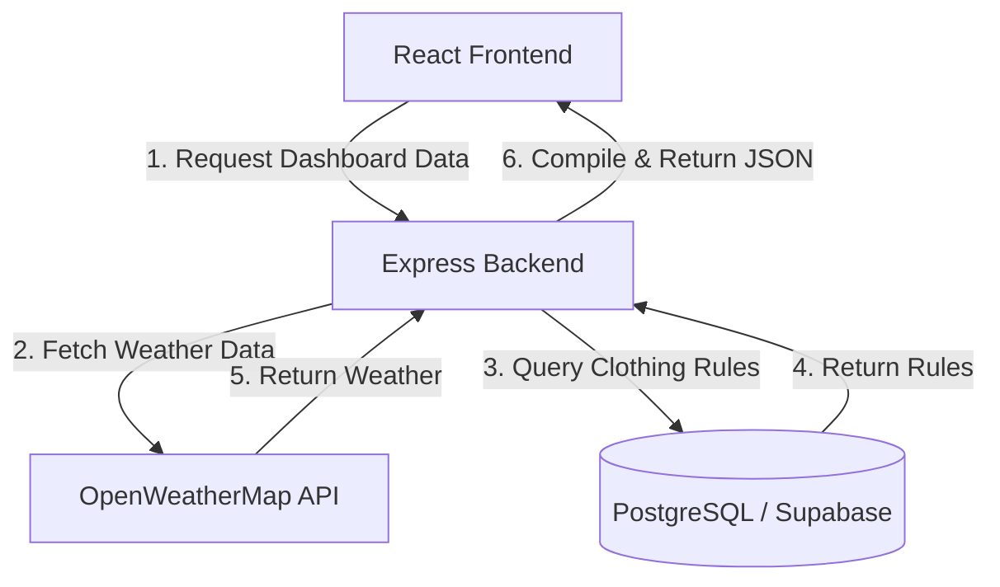

# Arsitektur Sistem - OOTDash

Dokumen ini menjelaskan desain teknis, struktur folder, dan aliran data dari proyek **OOTDash**.

---

## 1. Desain Sistem & Data Flow

OOTDash menggunakan pendekatan **Monorepo-lite** yang memisahkan aplikasi menjadi `client` (frontend) dan `server` (backend), dengan `supabase` sebagai penyedia layanan database lokal.



---

## 2. Struktur Folder Proyek

Proyek ini terorganisir sebagai berikut:

```
ootdash/
├── docs/                        # Dokumentasi Proyek
│   ├── architecture.md          # Dokumen Arsitektur
│   └── progress_report.md       # Laporan Progres & Verifikasi
├── supabase/                    # Konfigurasi Supabase CLI Lokal
│   ├── config.toml
│   └── seed.sql
├── client/                      # Frontend Application (React + Vite)
│   ├── public/                  # Aset Statis & Layers Manekin
│   │   └── layers/              # Aset PNG Pixel-Art (21 Layer Baju)
│   └── src/
│       ├── components/          # React Components (Dashboard, Mannequin, dll)
│       ├── hooks/               # Custom React Hooks (useGeolocation)
│       ├── lib/                 # Integrasi Eksternal (supabaseClient)
│       ├── store/               # State Management (Zustand Stores)
│       └── styles/              # Global Stylesheet (Tailwind CSS)
└── server/                      # Backend API Service (Express + TS)
    └── src/
        ├── controllers/         # Controller & Logika Rekomendasi
        ├── db/                  # Drizzle ORM Schema, Koneksi & Seeding
        ├── middlewares/         # Middleware Autentikasi JWT
        └── routes/              # Express API Routes
```

---

## 3. Logika Rekomendasi Pakaian

Algoritma pencocokan baju dilakukan sepenuhnya di sisi Backend untuk menghindari *waterfall requests*:
1. Mengambil data cuaca real-time (suhu & kondisi cuaca) dari koordinat user.
2. Memetakan kondisi cuaca ke enum internal: `Cerah`, `Berawan`, `Hujan`, `Badai`.
3. Memilih aturan pakaian (`clothing_rules`) dari database berdasarkan rentang suhu dan kecocokan kondisi cuaca.
4. Mengembalikan rekomendasi lengkap (atas, bawah, sepatu, aksesoris) beserta jalur aset gambar layer manekin.

---

## 4. Skema Database (Drizzle ORM)

```typescript
// Enums
export const genderEnum = pgEnum('gender', ['Pria', 'Wanita', 'Unisex']);
export const weatherConditionEnum = pgEnum('weather_condition', ['Cerah', 'Berawan', 'Hujan', 'Badai']);

// Users & Preferences
export const users = pgTable('users', {
  id: uuid('id').primaryKey(),
  name: varchar('name', { length: 100 }).notNull(),
  birthDate: date('birth_date').notNull(),
  gender: genderEnum('gender').notNull(),
  createdAt: timestamp('created_at').defaultNow(),
});

export const styleProfiles = pgTable('style_profiles', {
  id: serial('id').primaryKey(),
  profileName: varchar('profile_name', { length: 100 }).notNull(),
  targetGender: genderEnum('target_gender').notNull(),
  imageUrl: varchar('image_url', { length: 255 }),
});

export const userPreferences = pgTable('user_preferences', {
  userId: uuid('user_id').primaryKey().references(() => users.id, { onDelete: 'cascade' }),
  styleProfileId: integer('style_profile_id').references(() => styleProfiles.id),
});

// Clothing Rules (Logic Source)
export const clothingRules = pgTable('clothing_rules', {
  id: serial('id').primaryKey(),
  styleProfileId: integer('style_profile_id').references(() => styleProfiles.id, { onDelete: 'cascade' }),
  minTemp: integer('min_temp').notNull(),
  maxTemp: integer('max_temp').notNull(),
  weatherCondition: weatherConditionEnum('weather_condition').notNull(),
  topItem: varchar('top_item', { length: 100 }).notNull(),
  topNote: text('top_note').notNull(),
  bottomItem: varchar('bottom_item', { length: 100 }).notNull(),
  bottomNote: text('bottom_note').notNull(),
  shoesItem: varchar('shoes_item', { length: 100 }).notNull(),
  shoesNote: text('shoes_note').notNull(),
  accItem: varchar('acc_item', { length: 100 }),
  accNote: text('acc_note'),
});
```
